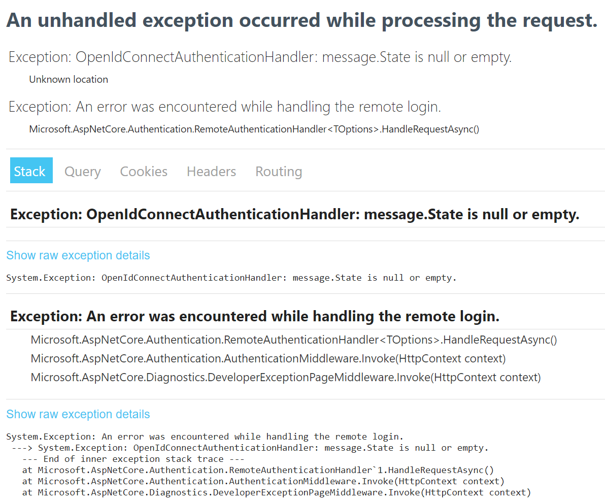

# RemoteAuthenticationHandler Error
## Error message
```
System.Exception: An error was encountered while handling the remote login.
 ---> System.Exception: Correlation failed.
   --- End of inner exception stack trace ---
   at Microsoft.AspNetCore.Authentication.RemoteAuthenticationHandler`1.HandleRequestAsync()
   at Microsoft.AspNetCore.Authentication.AuthenticationMiddleware.Invoke(HttpContext context)
   at Microsoft.AspNetCore.Diagnostics.DeveloperExceptionPageMiddleware.Invoke(HttpContext context)
```


## Solutions
### Directly specifying context.Request.Host (Tested solution and works)
Add the following in the Configure method in Startup.cs
```
app.Use((context, next) =>
{
    int port = context.Connection.LocalPort;
    string hostString = $"{Configuration["Domainname"]}:{port}";
    context.Request.Host = new HostString(hostString);
    return next();
});
```
and specify the Domainname in the application settings (e.g., appsettings.json)

### Use UseForwardedHeaders (Have not tested solution yet)
```
app.UseForwardedHeaders(new ForwardedHeadersOptions {
    ForwardedHeaders = ForwardedHeaders.XForwardedFor | ForwardedHeaders.XForwardedHost | ForwardedHeaders.XForwardedProto
});
```
https://docs.microsoft.com/en-us/dotnet/api/microsoft.aspnetcore.builder?view=aspnetcore-3.1

### "Sites that can never use cookies"
If in the Google Chrome settings, the domain name of the website is set under "Privacy and security" > "Cookies and other site data" > "Sites that can never use cookies", then this can also cause this error.

