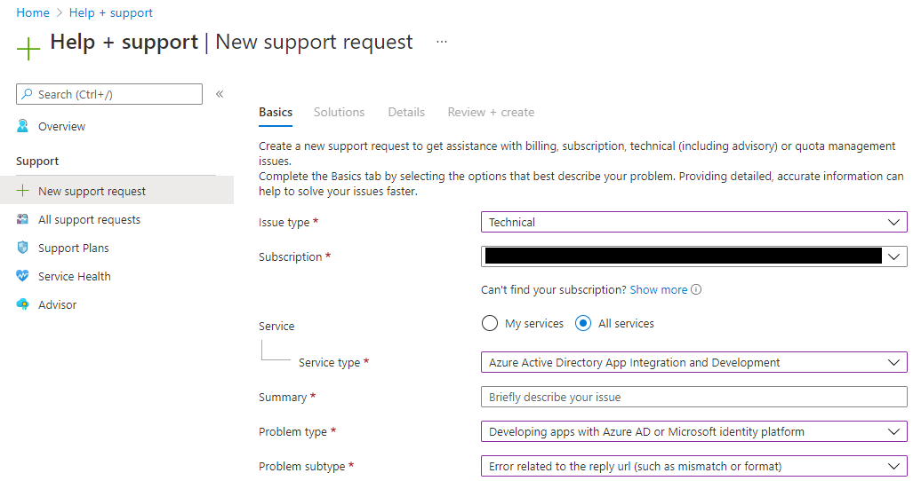

# Error AADSTS50011 - The reply URL specified in the request does not match the reply URLs configured for the application
## Microsoft documentation
The [documentation on docs.microsoft.com](https://docs.microsoft.com/troubleshoot/azure/active-directory/error-code-aadsts50011-reply-url-mismatch) as of April 16 2021, has some basic information about the cause of the error and resolution. My intention here is to eleborate on additional details regarding the cause and resolution.

## Description
Basically one of the following needs to be changed to match the other
- Reply URL specified in the request: This is the reply URL that is specified in the HTTP request to the oauth endpoint, which is usually defined by the server-side of the web application
- Reply URLs configured for the application: This is the list of URLs in the App Registration of Azure Active Directory. This is a list of URLs that Azure AD considers as a whitelist

## The challenge
The reason this error is challenging is because it involves the integration between various pieces
- Azure Active Directory
- Web Application
- Browser
- Often intermediary systems such as non-Azure reverse proxies, or load balalancing services on Azure (e.g., Application Gateway, Front Door)

each often managed by a different team or even different companies, where no single person has access to all the information that is needed to resolve the error.

## Azure Support Request
As of April 22 2021, when submitting a support request through the Azure Portal, this error appears in the list of expected questions.

### Recommended Solution from the Azure Portal
As of April 22 2021, the following is displayed recommendations before submitting a ticket, and it provides a good overview of things to consider
>Redirect URI/reply URLs (both expressions are interchangeable) are the URL used by the Microsoft identity platform to return app-requested tokens.
>
>Recommended Steps
>I don't know how to register the right redirect URI / reply URL for my app
>When you sign in with the application you are developing, if the sign-in dialog displays AADSTS50011: The reply url specified in the request does not match the reply urls configured for the application , you'll need to add to your application registration, the redirect URI that your code used in the token request to the Microsoft identity platform.
>
>To add a reply URL, go to the Authentication tab in your application registration, in the Azure portal and add an entry in the Redirect URIs section. Redirect URIs are typed (Web or mobile/desktop). The value you need to enter depends on the type of application you're building:
>
>- For single page applications and web apps, the reply URL is a URL in your application. See [Single-page application registration](https://docs.microsoft.com/azure/active-directory/develop/scenario-spa-app-registration?WT.mc_id=Portal-Microsoft_Azure_Support#register-a-redirect-uri) or [Register a web app app using Azure portal](https://docs.microsoft.com/azure/active-directory/develop/scenario-web-app-sign-user-app-registration?tabs=aspnetcore&WT.mc_id=Portal-Microsoft_Azure_Support#register-an-app-using-azure-portal)
>- For desktop applications the value that you need to choose depends on:
>   - the platform (MacOS is different from Windows or Linux)
>   - the way you acquire the token (interactively, with device code flow, with integrated Windows authentication or with username/password)
>For details see [Desktop apps - App registration - Redirect URi](https://docs.microsoft.com/azure/active-directory/develop/scenario-desktop-app-registration?WT.mc_id=Portal-Microsoft_Azure_Support#redirect-uris).
>
>- For mobile applications, the redirect URI depends on:
>   - the platform (iOS/Android/UWP)
>   - the information used to build your app such as the bundle ID in iOS, and the package name and signature hash on Android
>The Azure portal app registration will help you. For details see [Platform configuration and redirect URIs](https://docs.microsoft.com/azure/active-directory/develop/scenario-mobile-app-registration?WT.mc_id=Portal-Microsoft_Azure_Support#platform-configuration-and-redirect-uris)
>
>NOTE: Web APIs, and some of the silent ways of acquiring tokens (Windows Integrated Authentication and username password) don't require a redirect URI.
>
>I've deployed my web application and when I test the deployed app, I get a reply url mismatch message
>When you deploy your web application, you need to add redirect URIs for all the locations where you deploy it. See [Register a web app app using Azure portal](https://docs.microsoft.com/azure/active-directory/develop/scenario-web-app-sign-user-app-registration?tabs=aspnetcore&WT.mc_id=Portal-Microsoft_Azure_Support#register-an-app-using-azure-portal).
>
>I can't register enough reply URLs
>You're an ISV and have one or several redirect URIs per your customers. You want to migrate from ADAL/Azure AD v1.0 to MSAL/the Microsoft identity platform and you hit [the maximum number of redirect URIs](https://docs.microsoft.com/azure/active-directory/develop/reply-url?WT.mc_id=Portal-Microsoft_Azure_Support#maximum-number-of-redirect-uris). To resolve this, [add redirect URIs to service principals](https://docs.microsoft.com/azure/active-directory/develop/reply-url?WT.mc_id=Portal-Microsoft_Azure_Support#add-redirect-uris-to-service-principals) corresponding to each of your customers.
>
>Recommended Documents
>- [Authentication flows and application scenarios](https://docs.microsoft.com/azure/active-directory/develop/authentication-flows-app-scenarios?WT.mc_id=Portal-Microsoft_Azure_Support). In this article, you'll find useful information about the redirect URIs in the App registration page for each scenario.
>- [Redirect URI/reply URL restrictions and limitations](https://docs.microsoft.com/azure/active-directory/develop/reply-url?WT.mc_id=Portal-Microsoft_Azure_Support)

## Solutions
- Changing the reply URL specified in the request
  - Change it in the application code (e.g., using the same way as outlined in [RemoteAuthenticationHandler Error](./RemoteAuthenticationHandler-error.md))
  - Other
- Adding the reply URL specified in the request to the list of reply URLs configured for the application

# Debugging
## 2021 September 21
- Before the incident: Demo Product in the release environment displayed correctly
- What was updated: I updated text in an html file
- After the update: AADSTS50011 error, when refreshing the website
- Resolution: Access the website again, and the error goes away
- Cause: Not sure what that cause is, but it seems to happen everytime I update the code. Does not seem to happen for the production environment

