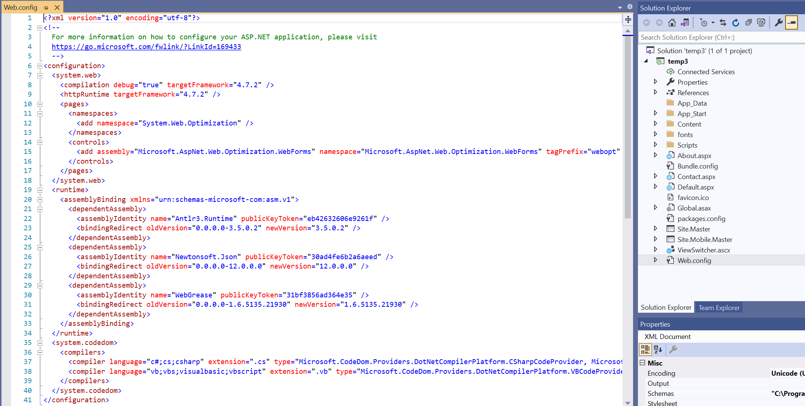

# ASP.NET Web Application (.NET Framework)

## Web Form
### Template generated by Visual Studio

### References
- eShopModernizingWCFWinForms: https://github.com/dotnet-architecture/eShopModernizing/blob/master/winforms-wcf.md
- Migrate an ASP.NET web application to Azure with Visual Studio: https://docs.microsoft.com/en-us/learn/paths/migrate-aspnet-web-application/
- https://docs.microsoft.com/en-us/azure/app-service/app-service-web-tutorial-dotnet-sqldatabase
- https://docs.microsoft.com/en-us/dotnet/azure/migration/app-service?view=azure-dotnet
- https://docs.microsoft.com/en-us/aspnet/web-forms/overview/older-versions-getting-started/tailspin-spyworks/tailspin-spyworks-part-1
- https://docs.microsoft.com/en-us/aspnet/web-forms/overview/deployment/visual-studio-web-deployment/introduction
- https://docs.microsoft.com/en-us/dotnet/architecture/porting-existing-aspnet-apps/migrate-web-forms
- https://docs.microsoft.com/en-us/dotnet/azure/migration/app-service
- https://www.mobilize.net/blog/converting-asp.net-web-forms-apps-to-asp.net-core-and-angular/html5-mobilize.net

## MVC
### Template generated by Visual Studio

## Web API
### Template generated by Visual Studio

## Single Page Application
### Template generated by Visual Studio
