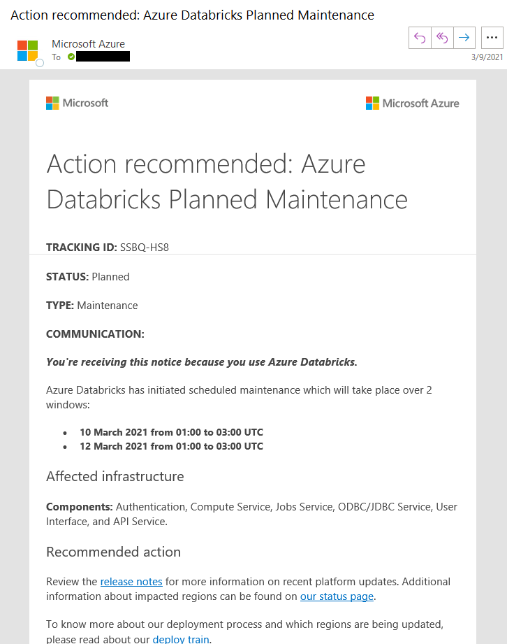

# Question
What does the e-mail notification for planned Azure maintenance look like, when notification settings are applied using the steps outlined in [link](https://docs.microsoft.com/azure/azure-sql/database/advance-notifications)?

# Answer
## As of March 9th 2021
From: Microsoft Azure <azure-noreply@microsoft.com> 
Subject: Action recommended: XXX Planned Maintenance
