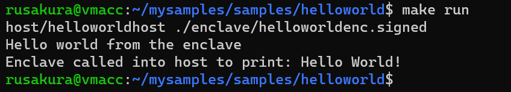

# Confidential computing
## Terminology
- [Azure confidential computing](https://azure.microsoft.com/en-us/solutions/confidential-compute/): A solution that Microsoft provides for protecting your data and code while the data is in use in the cloud. 
- [Azure Confidential Computing (Virtual Machine)](https://azuremarketplace.microsoft.com/en-us/marketplace/apps/microsoft-azure-compute.acc-virtual-machine-v2): An Azure virtual machine with confidential computing features. "This template will allow you to deploy the newest family of virtual machines that enable confidential computing features. With just a few configurations and a single-click deployment, you can build secure enclave-based applications to run inside of the virtual machine to protect your data and code, end-to-end. The DCsV2-Series Virtual Machines are backed by the latest generation of Intel Xeon processors with Intel SGX technology."

# Learning resources
## Microsoft Build 2021
### How to use Azure Confidential Computing using Intel SGX to protect apps and solutions in the cloud
https://mybuild.microsoft.com/sessions/9b302a26-7867-4c83-8e28-d51524e27762?source=sessions
- What and why of confidential computing
- Microsoft Azure Attestation
- Azure Key Vault Managed HSM
- Partners: Intel, Fortanix, Anjuna, Scone, Edgeless, R3, University of California San Francisco, etc.
- High-level architecture and demo of Fortanix Confidential Computing Manager on Azure and Fortanix Confidential Computing Node Agent
- Example: BeekeeperAI - Brings clinical data and algorithms together securely
  - BeeKeeper AI, Fortanix, Azure, Intel
  - Data never moves
  - PHI is never exposed nor shared
  - Algorithm IP is protected
- Links
  - https://aka.ms/AzureCC
  - https://intel.com/trustSGX

## Plan
1. Deploy an Azure Confidential Computing (Virutal Machine)
2. Following the instructions here https://github.com/Azure-Samples/confidential-container-samples/tree/main/confidential-healthcare-scone-confinf-onnx

## Deploying and configuring a Confidential Computing VM
### Instructions and expected outcome
By following [these instructions](https://github.com/microsoft/onnx-server-openenclave), I was able to run the following command, resulting in the following output on a Linux virutal machine on Azure

### Tips for following the instructions
While [this page](https://github.com/microsoft/onnx-server-openenclave) is the root for all instructions with multiple links, I ended up referencing the following pages
1. https://docs.microsoft.com/en-us/azure/confidential-computing/quick-create-marketplace
2. https://docs.microsoft.com/en-us/azure/virtual-machines/ssh-keys-portal
3. https://github.com/openenclave/openenclave/blob/master/docs/GettingStartedDocs/Linux_using_oe_sdk.md
4. https://github.com/openenclave/openenclave/blob/master/samples/BuildSamplesLinux.md

## Temp memo
Made suggestion to docs:
https://github.com/microsoft/onnx-server-openenclave/issues/6