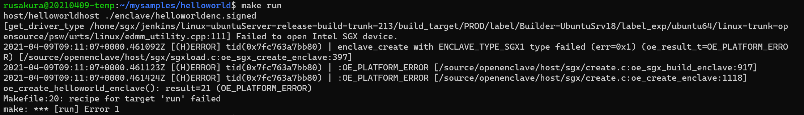

# Context
I heard about Azure Confidential Computing and Open Enclave in one of Mark Russinovich's sessions, so decided to try running the helloworld with a colleague.

# Steps
## Deploy an Azure confidential computing VM
The first step is to prepare a computing environment to run Open Enclave:
https://docs.microsoft.com/en-us/azure/confidential-computing/quick-create-portal

After following the steps in the above link, we created a custom image and shared it in a Shared Image Gallery, so that we could deploy deploy the computing environment more easily in the future.

## Building and Running the Samples on Linux

https://github.com/openenclave/openenclave/blob/master/samples/BuildSamplesLinux.md

```bash
cp -r /opt/openenclave/share/openenclave/samples ~/mysamples
. /opt/openenclave/share/openenclave/openenclaverc
cd ~/mysamples/helloworld
make build
make run
```

# Debugging
## 'Failed to open Intel SGX device' when running 'make run'
