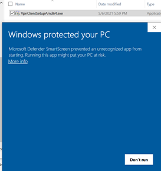
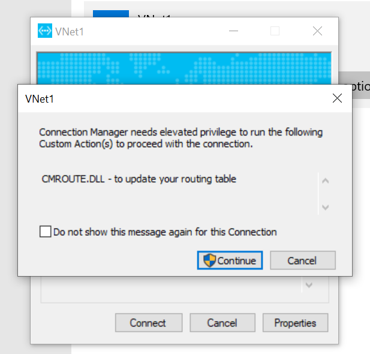
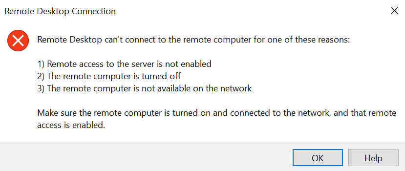

# Official Documentation
[Configure a Point-to-Site VPN connection to a VNet using native Azure certificate authentication: Azure portal](https://docs.microsoft.com/en-us/azure/vpn-gateway/vpn-gateway-howto-point-to-site-resource-manager-portal)

# Notes from when I went through the official documentation
- Spent about 1.5-2 hours from start (reading the documentation) to end (testing the P2S VPN connection)
- Took about 0.5-1 hour to create the VPN Gateway, but was able to use that time to work on some of the other steps
- Address space of 10.1.0.0/16 for VNet
- 10.1.0.0/24 for the "FrontEnd" subnet, which includes the VM with private IP address of 10.1.0.4
- 10.1.1.0/27 for the "GatewaySubnet" subnet, which includes the VPN Gateway with addres pool of 172.16.201.0/24
- SKU="VpnGw2", VPN type="Route-based", Tunnel type="IKEv2 and SSTP (SSL)", Generation="Generation2" for the  of the VPN Gateway
- Created and used self-signed certificate
- Worked on a Windows 10 laptop, and used PowerShell in Windows Terminal for command-line

# Screen shots that were not in the official documentation
## Microsoft Defender SmartScreen
Just needed to click "More Info" as described in the documentation

## Connection Manager needing elevated priviledge to update routing table
Just needed to click "Continue"

## When RDPing to private IP address without VPN connection
The following popped up when RDPing to private IP address without VPN connection, which was expected behavior

